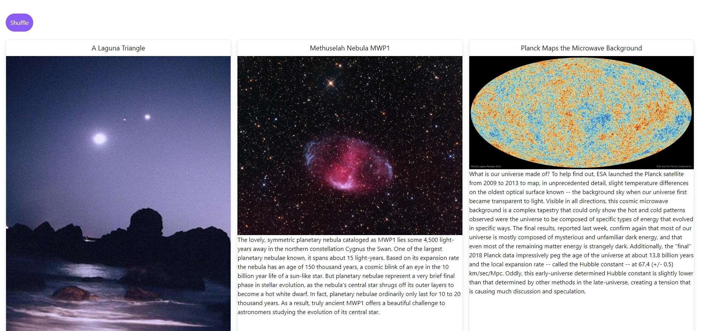

This project is a react project that utilizes simple card components (which could be reused) to display random pictures from a NASA api that include information about 
each picture. You can also shuffle the pictures in order to get new ones at any time. 

